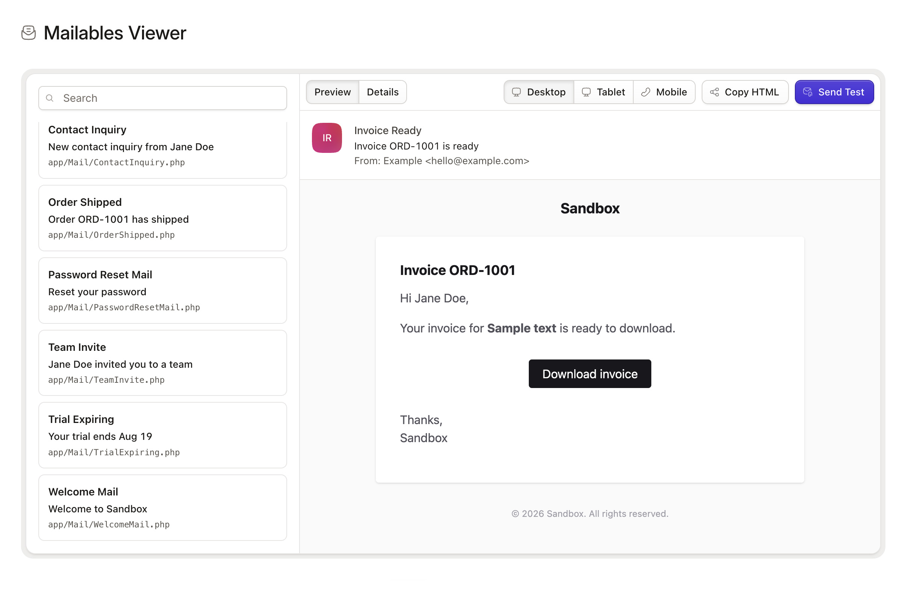

<!-- statamic:hide -->
# Mailables Viewer

> Preview Laravel mailables from the Statamic Control Panel.


<!-- /statamic:hide -->

## Features

- Discovers concrete `Illuminate\Mail\Mailable` classes in `app/Mail`
- Renders a live HTML preview
- Injects sample constructor data (scalars, Eloquent models, Statamic users/entries/forms)
- Lets you edit strings, numbers, bools, and datetimes and see the preview update
- Shows subject, from, attachments, template, queue status, and where the mailable is referenced
- Sends a test email with `sendNow()`

## Installation

You can install the Mailables Viewer addon via Composer:

```
composer require statamic/mailables-viewer
```

Then visit **Utilities → Mailables** in the Control Panel. Super users see it automatically. Everyone else needs the `access mailables utility` permission.

## Usage

Any concrete mailable in `app/Mail` is discovered automatically.

Register mailables that live elsewhere:

```php
use Statamic\MailablesViewer\Mailables;

Mailables::register(\App\Mail\Billing\InvoiceReady::class);
```

You can pass a class or an array of classes. The `Mailables` facade is also available as a Laravel alias.

### Constructor data

The viewer instantiates each mailable with sample values so you can preview it without writing a factory.

| Type | What happens |
| --- | --- |
| `string`, `int`, `float`, `bool`, datetimes | Fake sample values you can edit in Details |
| Statamic `User`, `Entry`, `Form`, `Submission` | First available record |
| Eloquent models | Factory `make()`, then `query()->first()`, then `::make()` |
| Anything else | Resolved from the container |

Objects and arrays stay read-only. Edit a scalar and the preview plus envelope (subject, from, attachments) refresh live.

Sample strings are guessed from the parameter name (`email` → `preview@example.com`, `name` → `Jane Doe`, `url` → `https://example.com`).

### Sending tests

Pick a mailable, optionally tweak the editable values, enter an address, and send. Tests use `sendNow()` so queued mailables still go out immediately.

## Requirements

- PHP 8.2+
- Statamic 6
